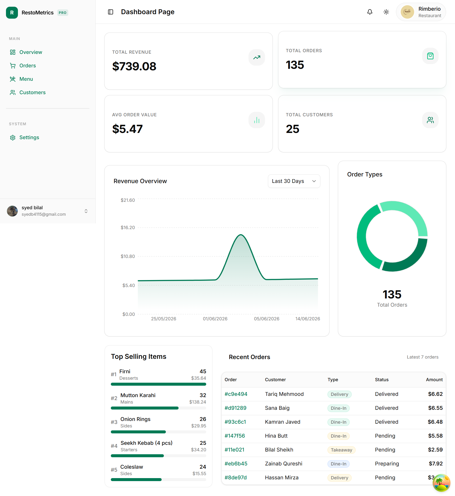
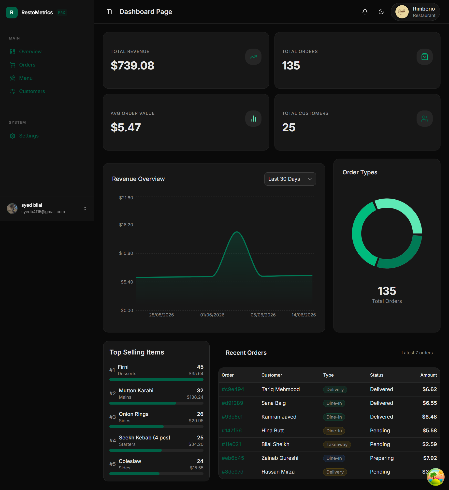
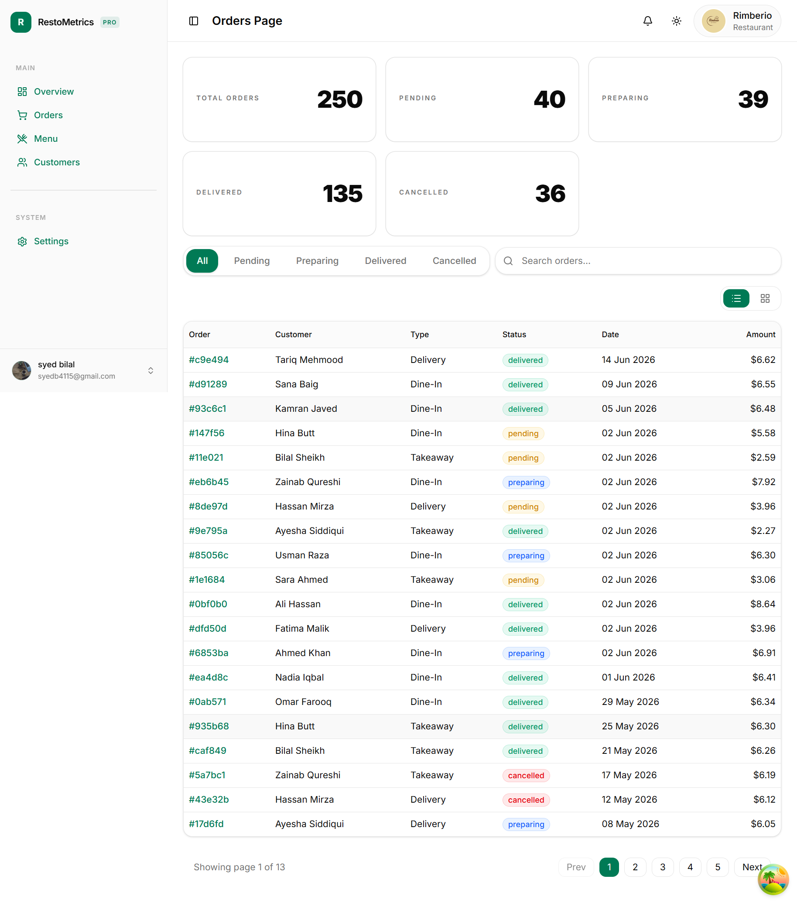
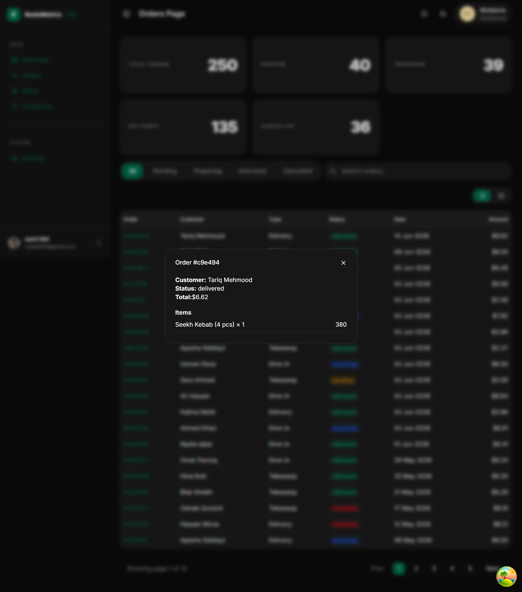

# RestoMetrics

A restaurant analytics and management SaaS dashboard. Built for restaurant owners who want to monitor revenue, track orders, manage their menu, and understand their customers — all in one place.

**Live Demo:** [restometrics.vercel.app](https://restometrics.vercel.app)

---

## Tech Stack

**Frontend**

- React 19 + TypeScript
- Vite
- Tailwind CSS + shadcn/ui
- React Router v6
- React Hook Form + Zod
- Recharts
- date-fns

**Auth & Backend**

- Clerk (Authentication + Google OAuth)
- Supabase (Database + Storage)
- React Query (Server state)
- Zustand (UI state)

---

## Features

### Dashboard

- Revenue overview with area chart (7 / 15 / 30 / 60 / 90 day toggle)
- Order type distribution (dine-in / delivery / takeaway)
- Top selling menu items
- Recent orders table
- Key metrics: total revenue, orders, avg order value, customers

### Orders

- Full orders table with pagination
- Filter by status (pending / preparing / delivered / cancelled)
- Search by customer name
- Grid and list view toggle

### Menu Management

- Add / edit / delete menu items
- Image upload to Supabase Storage
- Category filter
- Toggle item availability

### Customers

- Customer list with search
- Total orders and spend per customer
- Order history modal per customer

### Settings

- Restaurant name and logo
- Currency (PKR / USD / EUR / GBP / AED) with live conversion
- Tax rate configuration

### Auth

- Email + password signup with verification
- Google OAuth
- Protected routes
- Dark / light mode (persisted)

---

## Getting Started

```bash
# Install dependencies
bun install

# Start dev server
bun run dev

# Build for production
bun run build
```

### Environment Variables

Create a `.env` file in the root:

```bash
VITE_SUPABASE_URL=
VITE_SUPABASE_ANON_KEY=
VITE_CLERK_PUBLISHABLE_KEY=
VITE_EXCHANGE_API_KEY=
```

---

## Project Structure

src/
├── app/ # Router and providers
├── features/ # Feature-based modules
│ ├── auth/
│ ├── dashboard/
│ ├── orders/
│ ├── menu/
│ ├── customers/
│ └── restaurants/
│ └── user/
├── components/ # Shared UI components
├── hooks/ # Global hooks
├── store/ # Zustand stores
├── types/ # TypeScript types
└── lib/ # Utilities

---

## Screenshots

### Dashboard




### Orders




### Menu


## Author

**Syed Bilal** — React Developer from Karachi, Pakistan

[](https://github.com/iamsyedbilal)
[](https://twitter.com/SyedBilal200)
